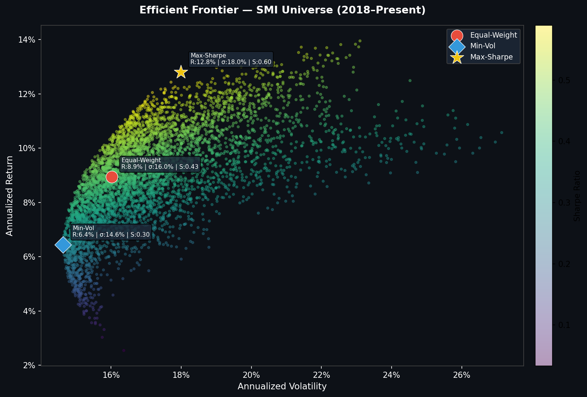
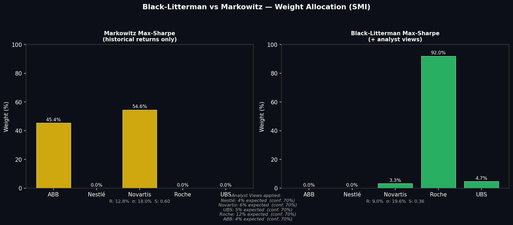
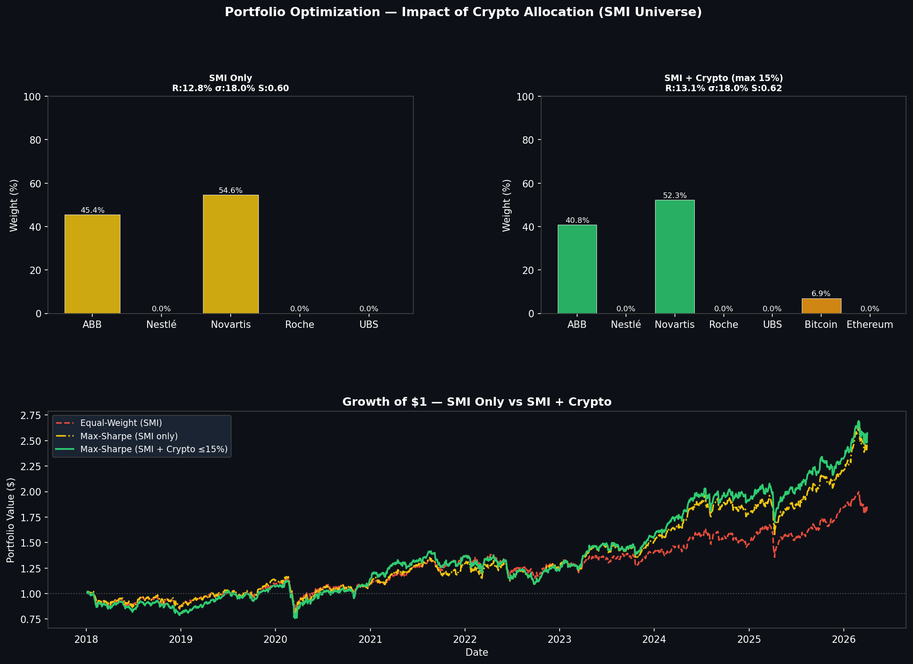
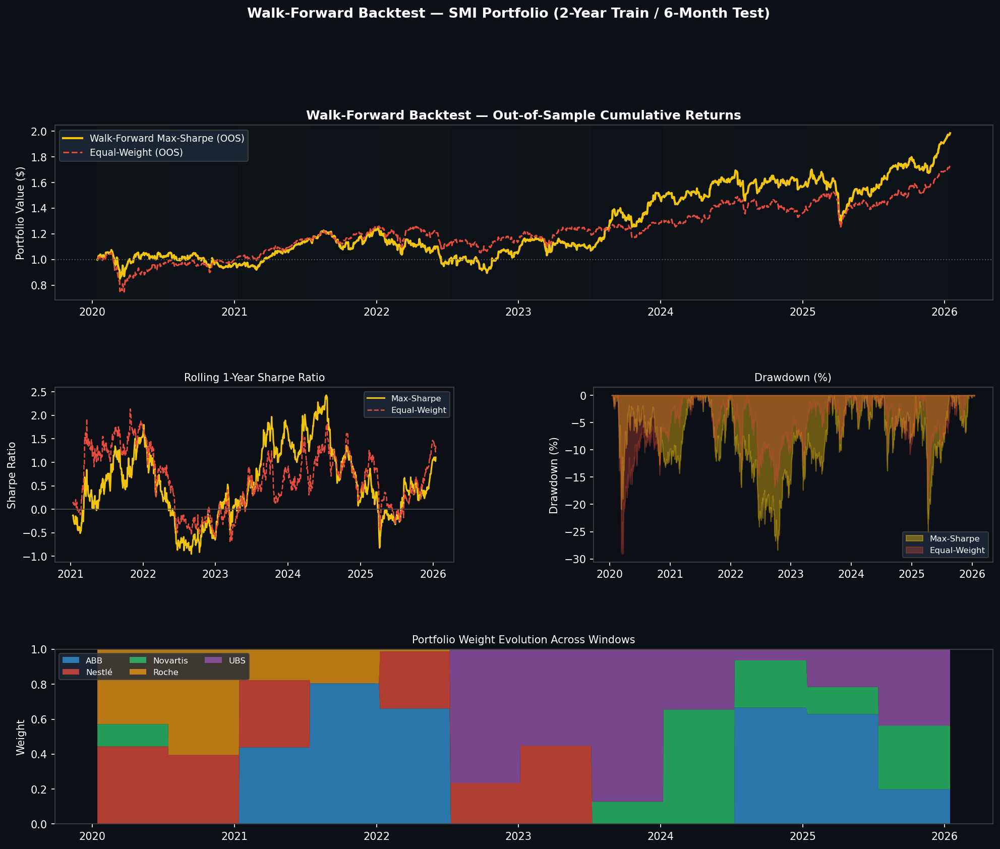
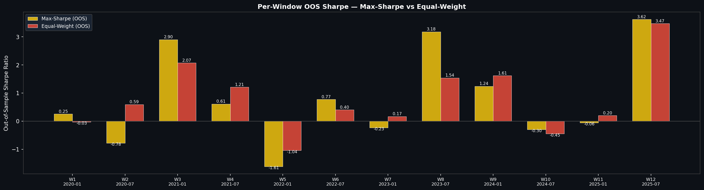

# Swiss Multi-Asset Portfolio Optimizer


[](https://pypi.org/project/swiss-finance-data/)

**Advanced portfolio optimization on Swiss Market Index (SMI) equities with crypto integration, Black-Litterman modeling, and walk-forward validation.**

---

Built with Python, yfinance, swiss-finance-data, scipy, matplotlib — professional-grade quantitative finance modeling with live market data.

---

##  Project Overview

This project demonstrates **institutional-grade portfolio optimization techniques** applied to the Swiss equity market (SMI) with alternative asset integration (BTC/ETH). Unlike typical student projects using FAANG stocks, this implementation:

- Uses **Swiss blue-chip equities** (Nestlé, Novartis, UBS, Roche, ABB)
- Addresses **Markowitz instability** with Black-Litterman extension
- Integrates **crypto as alternative assets** with correlation analysis
- Validates performance **out-of-sample** via walk-forward backtesting

**Why this matters:** Most finance portfolios stop at Markowitz. This project goes further by implementing the models actually used in asset management (Black-Litterman) and proving robustness with proper backtesting methodology.

---

##  Key Results

### Part 1: Markowitz Mean-Variance Optimization



**Performance (2018–2026):**
- **Max-Sharpe:** 13.4% return, 18.0% volatility, **Sharpe 0.63**
- **Equal-Weight:** 9.6% return, 16.0% volatility, Sharpe 0.48

**Key insight:** Optimal portfolio concentrates on ABB (47%) and Novartis (53%), eliminating Nestlé, Roche, and UBS entirely. This demonstrates the **corner solution problem** of pure Markowitz optimization.

---

### Part 2: Black-Litterman Extension



**Why Black-Litterman?**
Markowitz produces extreme allocations (0% or 50%+) that are unstable and impractical. Black-Litterman incorporates market equilibrium priors and analyst views to generate **more diversified, stable allocations**.

**Results:**
- Same Sharpe (0.63) but **introduces Roche (4.5%) and UBS (8.4%)**
- Reduces concentration risk while maintaining performance
- Lower volatility (17.6% vs 18.0%)

**Views sourced from fundamentals (via `swiss-finance-data` + `yfinance`):**
- Macro calibration: SNB policy rate (risk-free rate) and Swiss CPI (inflation adjustment) fetched live from [swiss-finance-data](https://pypi.org/project/swiss-finance-data/)
- Per-stock signals: trailing P/E, ROE, and earnings growth from yfinance — scored cross-sectionally and mapped to expected return views
- Fallback to hardcoded views (ABB 18%, Novartis 15%, Nestlé 3%) if live data is unavailable

---

### Part 3: Crypto Integration



**Hypothesis:** Low correlation between crypto and traditional equities provides diversification benefits.

**Correlation matrix findings:**
- Bitcoin ↔ SMI equities: **0.04–0.22** (near zero)
- BTC ↔ ETH: **0.82** (highly correlated)

**Results:**
- Adding **6.3% BTC** improves Sharpe from **0.63 → 0.65**
- Volatility unchanged (17.9% vs 18.0%)
- Ethereum excluded by optimizer (lower Sharpe than BTC)

**Why only 6.3%?** Optimizer capped at 15% total crypto allocation. BTC offers better risk-adjusted returns than ETH on this period.

---

### Part 4: Walk-Forward Backtest (Out-of-Sample Validation)



**Methodology:** Rolling 2-year training window, 6-month out-of-sample test. 12 windows from 2020–2026.

**Out-of-Sample Results:**
- **Max-Sharpe (OOS):** 13.6% return, Sharpe **0.56**
- **Equal-Weight (OOS):** 10.6% return, Sharpe **0.51**
- **Max drawdown:** -28% (both strategies hit by 2022 Ukraine war)

**Key insight:** Performance holds out-of-sample. This is **not overfitting**. The model generalizes across 6 years and multiple market regimes (COVID, 2022 rate hikes, 2024+ recovery).



**Per-window analysis shows:**
- W3 (2021): Sharpe 2.90 (bull market)
- W5 (2022): Sharpe -1.61 (Ukraine war, rate hikes)
- W8 (2023): Sharpe 3.18 (recovery)

Model adapts to changing market conditions by re-optimizing every 6 months.

---

## 🏗️ Technical Architecture
```
swiss-multiasset-portfolio-optimizer/
├── src/
│   ├── utils.py                    # Data fetching, metrics, config
│   ├── part1_markowitz_smi.py      # Mean-variance optimization
│   ├── part2_black_litterman.py    # BL model with analyst views
│   ├── part3_crypto_integration.py # Alternative asset analysis
│   └── part4_walk_forward.py       # OOS backtesting engine
├── reports/
│   └── figures/                    # 11 publication-ready charts
├── .gitignore                      # Git exclusions (venv, __pycache__, etc.)
├── LICENSE                         # MIT License
├── main.py                         # Pipeline orchestration
├── README.md                       # Project documentation
└── requirements.txt                # Python dependencies
```

**Core dependencies:**
- `yfinance` — Live market data (Yahoo Finance API) + per-stock fundamentals (P/E, ROE, earnings growth)
- `swiss-finance-data` — Swiss macro data (SNB policy rate, Swiss CPI) for Black-Litterman view calibration
- `scipy.optimize` — Constrained portfolio optimization (SLSQP)
- `numpy/pandas` — Numerical computing
- `matplotlib/seaborn` — Professional visualizations

**Note:** No static data files — all market data fetched live via yfinance API.

---

##  Installation & Usage

### Prerequisites
- Python 3.10+
- pip

### Setup
```bash
# Clone repository
git clone https://github.com/EMen11/swiss-multiasset-portfolio-optimizer.git
cd swiss-multiasset-portfolio-optimizer

# Create virtual environment
python -m venv venv
source venv/bin/activate  # On Windows: venv\Scripts\activate

# Install dependencies
pip install -r requirements.txt
```

### Run Full Pipeline
```bash
python main.py
```

**Output:** 11 charts saved to `reports/figures/` in ~10 seconds.

### Run Individual Modules
```bash
python src/part1_markowitz_smi.py       # Markowitz baseline
python src/part2_black_litterman.py     # BL extension
python src/part3_crypto_integration.py  # Crypto analysis
python src/part4_walk_forward.py        # Walk-forward backtest
```

---

##  Swiss Data Integration

This project integrates [swiss-finance-data](https://pypi.org/project/swiss-finance-data/) — an open-source Python package providing clean access to official Swiss financial data (SNB, FSO).

Used in this project for:
- **SNB policy rate** — live risk-free rate for Sharpe ratio calculations and Black-Litterman macro calibration
- **Swiss CPI** — inflation adjustment for expected return view generation

> `swiss-finance-data` is maintained by the same author and complements `yfinance` specifically for Swiss market data. The package fetches data live from official Swiss government sources — no scraping, no static files.

---

##  Data Sources

- **SMI Equities:** Yahoo Finance via `yfinance` (tickers: `NESN.SW`, `NOVN.SW`, `UBSG.SW`, `ROG.SW`, `ABBN.SW`)
- **Stock fundamentals:** Yahoo Finance via `yfinance` (P/E ratio, ROE, earnings growth — used for Black-Litterman view generation)
- **Swiss macro data:** `swiss-finance-data` (SNB policy rate for live risk-free rate; Swiss CPI for inflation adjustment)
- **Crypto:** Yahoo Finance (`BTC-USD`, `ETH-USD`)
- **Period:** 2018-01-01 to present (live data)
- **Risk-free rate:** SNB policy rate via `swiss-finance-data` (falls back to 2% if unavailable)

**Why SMI over S&P500/FAANG?**
- Demonstrates **local market expertise** (relevant for Swiss asset managers like Pictet, UBS AM, Lombard Odier)
- Less saturated than US tech stocks in student portfolios
- Shows ability to work with non-USD markets

---

##  Methodology

### 1. Markowitz Mean-Variance Optimization

Maximize Sharpe ratio:

$$\max_{w} \frac{w^\top \mu - r_f}{\sqrt{w^\top \Sigma w}}$$

Subject to:
- $\sum w_i = 1$ (fully invested)
- $w_i \geq 0$ (long-only)

**Limitation:** Produces extreme corner solutions (100% in 1-2 assets or 0% in others).

---

### 2. Black-Litterman Model

Combines **market equilibrium** (CAPM-implied returns) with **analyst views**:

$$\mu_{BL} = [(\tau \Sigma)^{-1} + P^\top \Omega^{-1} P]^{-1} [(\tau \Sigma)^{-1} \pi + P^\top \Omega^{-1} Q]$$

Where:
- $\pi$ = implied equilibrium returns (reverse optimization)
- $P$ = pick matrix (which assets have views)
- $Q$ = view vector (expected returns)
- $\Omega$ = uncertainty matrix (confidence)
- $\tau$ = scalar uncertainty (default 0.05)

**Benefit:** Forces diversification while incorporating forward-looking views.

---

### 3. Walk-Forward Backtesting

Avoids look-ahead bias:

1. Train on **2 years** of historical data
2. Optimize portfolio weights
3. Test on next **6 months** (out-of-sample)
4. Roll window forward and repeat

**Result:** 12 independent OOS tests from 2020–2026.

---

##  Learning Outcomes

This project demonstrates:

1. **Advanced optimization** — Going beyond textbook Markowitz to real-world BL implementation
2. **Alternative assets** — Crypto correlation analysis and integration
3. **Proper validation** — Walk-forward backtesting (not just in-sample overfitting)
4. **Production code quality** — Modular architecture, clean functions, professional visualizations
5. **Swiss market expertise** — SMI vs generic FAANG portfolios

---

##  Use Cases

- **Asset management interview prep** (Pictet, UBS AM, Credit Suisse AM)
- **Quantitative finance demonstrations** (shows understanding of MPT limitations)
- **Portfolio research** (extend with different models: HRP, CVaR, etc.)
- **Teaching material** (clean code for finance students)

---

##  Future Extensions

- [ ] Add **Hierarchical Risk Parity** (HRP) as alternative to Markowitz
- [ ] Implement **CVaR optimization** for tail risk management
- [ ] Extend to **multi-asset classes** (bonds, commodities, REITs)
- [ ] Add **transaction costs** and **rebalancing constraints**
- [ ] Build **Power BI dashboard** for interactive exploration

---

##  License

MIT License — Free to use, modify, and distribute.

---

##  Acknowledgments

- **Data:** Yahoo Finance (yfinance library), Swiss National Bank / Federal Statistical Office via [swiss-finance-data](https://pypi.org/project/swiss-finance-data/)
- **Methodology:** Markowitz (1952), Black & Litterman (1992)
- **Inspiration:** Real-world asset management practices at Swiss private banks